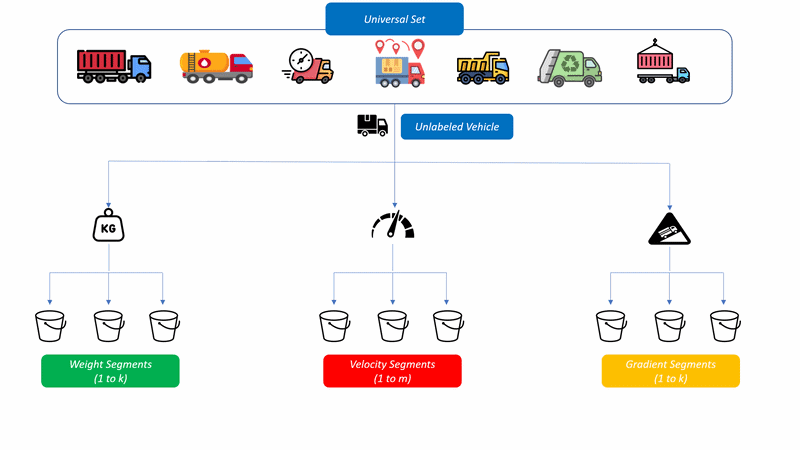
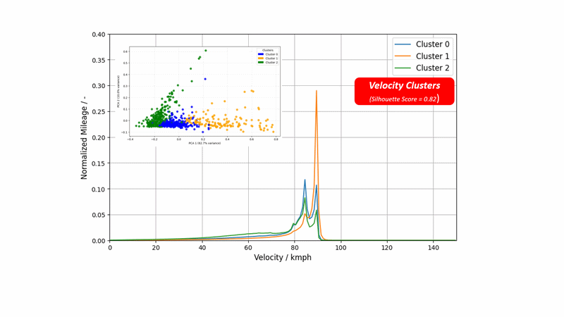
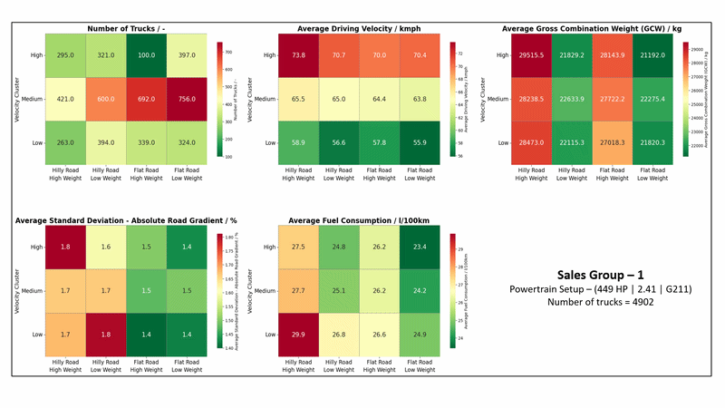

⭐ **1. Introduction**

Modern commercial vehicles generate high-frequency telemetry signals that are first processed and structured in a separate upstream pipeline (See Commercial-Vehicle-Telemetry-Analytics-Pipeline repository).

This project builds an end-to-end unsupervised learning pipeline on top of these structured signals to segment trucks based on their operational parameters

<table>
  <tr>
    <td align="center">
      <b></b> 
      
    </td>
  </tr>
</table>

---

🧩 **2. Challenge**

Fleet vehicles operate under highly diverse real-world conditions, where usage patterns vary significantly across customers, routes, payloads, driving styles, and powertrain configurations.

This project focuses on capturing and comparing these heterogeneous operating behaviors using distributional representations of key signals such as velocity, gross combination weight, and road gradient.

Each vehicle is represented as a normalized spectrum over ordered bins, describing how operating conditions are distributed over its lifetime usage. A key challenge is that these spectra cannot be meaningfully compared using simple point-wise distance measures, as they require a metric that respects both distribution shape and bin ordering.

Key challenges addressed in this work include:

- Capturing variability in vehicle usage across customers, payloads, road profiles, and driving styles.  
- Defining a similarity measure that respects the ordered structure of spectral distributions.  
- Comparing fleet behavior based on distributional shape rather than raw signal alignment.  
- Identifying meaningful structure in an unlabeled, highly heterogeneous fleet.  

---

🎯 **3. Objectives**

- Build spectral representations of vehicle behavior across velocity, weight, and road gradient dimensions.  
- Compute pairwise similarity using Wasserstein distance and apply k-medoids clustering for fleet segmentation.  
- Validate clustering results using interpretable visualizations and fleet-level cross-group analysis.

---

🛠 **4. Tech Stack**

This project is implemented using a scalable distributed data processing and analytics stack.

Key technologies include:

- scikit-learn-extra – k-medoids clustering for precomputed distance matrices  
- Custom Numba-optimized implementation – Wasserstein distance computation for large-scale pairwise spectral comparison  
- Apache Spark (PySpark) – distributed processing of fleet-scale telemetry data  
- Pandas / NumPy/ Matplotlib – intermediate transformations, numerical computation, visualization and validation  
- Delta Lake / Databricks Tables – persistent storage and scalable data management  

---

🧠 **5. Key Concepts** 

**Wasserstein Distance (Earth Mover’s Distance)**  
A distributional similarity metric that measures the minimum “cost” required to transform one ordered histogram into another while respecting bin structure.

**K-Medoids Clustering**  
An unsupervised clustering method that groups data based on pairwise distances by selecting real data points (medoids) as cluster centers, making it robust for non-Euclidean distance spaces like Wasserstein matrices.

**Silhouette Score**  
An internal clustering validation metric used to evaluate separation quality between k-medoids clusters based on the precomputed Wasserstein distance matrix, guiding the selection of optimal cluster configurations.

---

📈 **6. Sample Results**

The unsupervised clustering framework identifies 3 distinct velocity segments, 2 gross combination weight segments, and 2 road gradient segments. As a result, each truck in the fleet can be assigned to one of 3 × 2 × 2 = 12 possible operational sub-populations.

Each cluster is represented by a characteristic spectral profile (medoid), capturing its typical velocity, weight, and gradient behavior.

An interactive Spark-based dashboard enables flexible exploration of the results, allowing users to adjust fleet size, modify spectral bin resolution, and filter vehicles by customer or geographical region.

<table>
  <tr>
    <td align="center">
      <b> Analytics Dashboard Output Demo - Cluster Viz </b> 
      
    </td>
  </tr>
</table>

The dashboard also supports additional visualizations, including heatmaps for detailed cluster analysis.

Users can select a specific powertrain configuration (sales group) and explore aggregated metrics such as average mileage, weight, and other operational KPIs across all 12 identified sub-populations at once. As an example 4 specific sales groups are presented below.

<table>
  <tr>
    <td align="center">
      <b> Analytics Dashboard Output Demo - Heatmap </b> 
      
    </td>
  </tr>
</table>

Additional visualizations are available to support deeper exploration of the clustering results. These include pie charts illustrating cluster composition across different sales groups, principal component analysis (PCA) plots showing cluster separability in reduced-dimensional space, and density-based distribution plots to compare how operational signals vary across clusters.

These views help validate cluster structure and provide intuitive interpretation of fleet behavior patterns.

---

🏭 **7. Industrial Use Case of the Project**

With the help of this framework, each individual truck in the global fleet can be categorized into one of 12 distinct operational segments. This enables downstream analysis to evaluate whether the recommended powertrain configuration aligns with the actual real-world usage of the customer.

For example, it becomes possible to assess whether high-power engines are consistently assigned to use cases involving heavy payloads or steep terrain, or whether systematic mismatches exist between recommended specifications and real operating conditions.

Further analysis indicates that in approximately 25%–30% of cases, powertrain configurations are either over- or under-dimensioned relative to actual customer usage. This highlights a significant opportunity for fuel efficiency and cost optimization by better aligning powertrain selection with observed operational behavior.

---

📊 **8. Project Outcomes - Key Numbers**

This pipeline operates at commercial fleet scale and processes large-scale telematics data:

• 🚛 21,000+ commercial trucks analyzed  
• 🧑 300+ individual customers analyzed  
• 📊 15 powertrain configurations evaluated (SG1–SG15)  
• ⚙️ 0.8 - 0.9 silhouette scores achieved across clustering models  
• 🖥️ 3 analytical dashboards developed for cross-team collaboration  
• 📦 12 operational sub-populations identified through velocity, weight, and gradient clustering  

---

🧭 **9. Future Extensions**

Potential next-stage enhancements for this project include:

- Soft clustering approaches to assign trucks probabilistically across multiple operating profiles instead of rigid cluster boundaries  
- Multi-dimensional fleet segmentation using combined velocity, weight, gradient, and additional vehicle behavior signals within a unified clustering framework  
- Automated cluster interpretation and labeling to reduce manual analysis and improve scalability across new fleet populations  

---

⚠️ **10. Data Note**

This project uses proprietary internal datasets from Daimler Truck AG.  
Only the processing pipeline and code structure are shared in this repository for demonstration and learning purposes.  
No raw or sensitive data is included.

---

👨‍💻 **11. Key Takeaways / Skills Demonstrated**

Through this project, I demonstrate my ability to work on topics such as 

- Large-scale PySpark data engineering and pipeline design for fleet-scale analytics  
- Spectral modeling, Distance metric choice and computation, unsupervised ML model choice and implementation
- Cluster validation, visualization and interpretation using domain knowledge and cross-population analysis via analytical dashboards  

---
